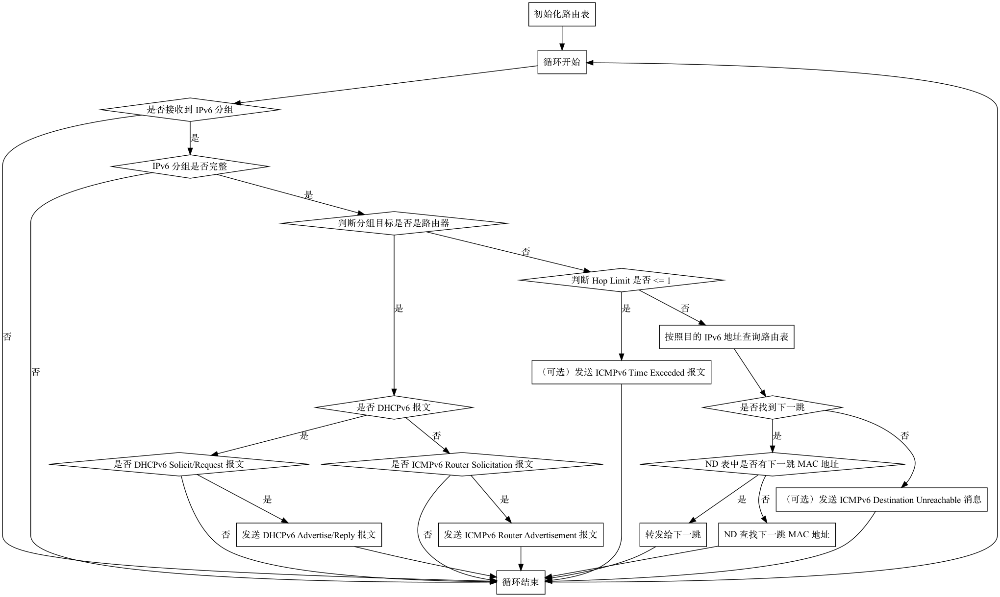

## DHCPv6 服务器

一个 DHCPv6 协议的服务器需要支持如下的功能：

1. 利用 IPv6 ND 和 DHCPv6 协议给客户端分配动态的 IPv6 地址

支持 DHCPv6 协议的服务器加上框架提供的基于静态路由表的转发功能，就得到了支持 DHCPv6 协议的路由器。

## 协议理解

在这一步，你需要实现一个 DHCPv6 协议的服务器。

客户端在尝试获取 IPv6 地址的时候，首先会通过 IPv6 ND（Neighbor Discovery）协议发送 RS（Router Solicitation）去寻找路由器，路由器向客户端发送 RA（Router Advertisement）表示自己是路由器，可以分配地址。那么，你需要首先阅读 [RFC 4861](https://www.rfc-editor.org/rfc/rfc4861)，理解其中关于 RS 的 RA 的部分，并能回答以下几个问题：

1. 数据格式是怎么样的？
2. IPv6 源地址是？目的地址是？
3. 在 RA 中，如何告诉客户端需要使用 DHCPv6 获取动态 IPv6 地址？
4. ICMPv6 的额外的 Options 是如何编码的？

客户端在收到 RA 以后，得知可以通过 DHCPv6 获得动态 IPv6 地址，此时客户端和服务端会按照 DHCPv6 协议来动态分配和获取 IPv6 地址。此时，你需要阅读 [RFC 8415](https://www.rfc-editor.org/rfc/rfc8415.html)，理解客户端和服务端之间发送的四个消息，并能回答下面的几个问题：

1. 客户端第一步要发送的是哪个消息？
2. 服务端收到客户端第一步发送的消息后，应该回应什么消息？
3. 客户端收到服务端的消息后，又要发送什么消息？
4. 最后服务端要发送什么消息，来完成 DHCPv6 的地址分配？

## 工作流程

可以回答以上几个问题以后，结合仓库中 `Homework/dhcpv6/main.cpp` 尝试理解下面的路由的工作流程：

1. 初始化路由表，加入直连路由；
2. 进入路由器主循环；
3. 接收 IPv6 分组，如果没有收到就跳到第 2 步；
4. 检查 IPv6 分组的完整性和正确性；
5. 判断 IPv6 分组目标是否是路由器：如果是，则进入 ICMPv6/DHCPv6 协议处理；如果否，则要转发；
6. 如果是 ICMPv6 Router Solicitation 报文，则构造对应的 ICMPv6 Router Advertisement 并回复；
7. 如果是 DHCPv6 Solicit/Request 报文，则构造对应的 DHCPv6 Advertise/Reply 并回复；
8. 如果这个 IPv6 分组要转发，判断 Hop Limit，如果 Hop Limit 正常，查询路由表，如果找到了，就转发给下一跳，转发时从 ND 表中获取下一跳 MAC 地址；
9. 跳到第 2 步，进入下一次循环处理。

也可以见下面的流程图：

理解上面的工作流程后，尝试回答以下的问题：

1. 为什么要区分转发逻辑/DHCPv6/ICMPv6 逻辑？它们用途分别是什么？
2. 客户端获取动态的 IPv6 地址，和上面哪些步骤有关？

当你可以回答上面的问题的时候，就可以开始代码编写了。

## 功能要求

由于 ICMPv6/DHCPv6 协议完整实现比较复杂，你只需要实现其中的一部分。必须实现的有：

1. 对收到的 ICMPv6 Router Solicitation 生成 ICMPv6 Router Advertisement 回复。
2. 对收到的 DHCPv6 Solicit 生成 DHCPv6 Advertise 回复。
3. 对收到的 DHCPv6 Request 生成 DHCPv6 Reply 回复。

可选实现的有（不加分）：

1. 实现 DHCPv6 Renew 支持
2. 实现 DHCPv6 Rapid Commit 支持
3. 给多个客户端动态分配地址
4. 持久化已经分配的地址，重启服务器后数据不丢失
5. 在 Hop Limit 减为 0 时，回复 ICMPv6 Time Exceeded (Hop limit exceeded in transit)，见 [RFC 4443 Section 3.3 Time Exceeded Message](https://datatracker.ietf.org/doc/html/rfc4443#section-3.3)。
6. 对 ICMPv6 Echo Request 进行 ICMPv6 Echo Reply 的回复，见 [RFC 4443 Echo Reply Message](https://datatracker.ietf.org/doc/html/rfc4443#section-4.2)。
7. 在接受到 IPv6 packet，按照目的地址在路由表中查找不到路由的时候，回复 ICMPv6 Destination Unreachable (No route to destination)，见 [RFC 4443 Section 3.1 Destination Unreachable Message](https://datatracker.ietf.org/doc/html/rfc4443#section-3.1)。

不需要实现的有：

1. 转发功能，支持直连路由和间接路由，包括 Hop Limit 减一，查表并向正确的 interface 发送出去。这一功能已经由框架提供。
2. NDP 的处理，已经在 HAL 中实现。
3. interface 状态的跟踪（UP/DOWN 切换）。

!!! attention "HONOR CODE"

    在 `router` 目录中，有一个 `HONOR-CODE.md` 文件，你需要在这个文件中以 Markdown 格式记录你完成这个作业时参考网上的文章或者代码、与同学的交流情况。
